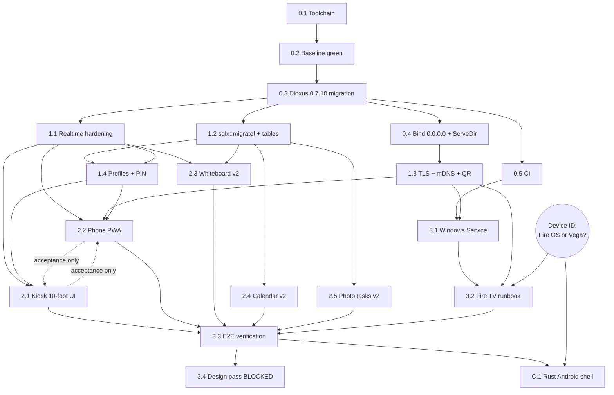

# WHITE TEAM — Neutral Audit of `docs/PLAN.md`

**Auditor:** White Team (referee / auditor — not attack, not defence)
**Date:** 2026-08-29
**Subject:** `C:\Family Calendar\docs\PLAN.md` (DRAFT v1, Fable 5)
**Method:** independent full read of the codebase (2,029 lines of `.rs` across `src/` and `tests/`, plus
`README.md`, `Cargo.toml`, `Cargo.lock`, `Dioxus.toml`, `assets/manifest.json`, `tailwind.config.js`,
`input.css`, `.gitignore`); live probing of the actual dev machine's toolchain; an actual
`cargo check --features server --all-targets` run; and web fact-checking of every version claim and
platform assumption in Sections 2 and 7.

**VERDICT: REWORK** — narrow in scope, blocking in effect. See Section I.

---

## Executive summary

This plan is well above average. Its reading of the code is largely accurate (16 of 19 findings hold
up in full), its architecture is mostly sound, and its acceptance criteria are unusually concrete for
a document of this kind. Three things stop it being approvable as written:

1. **D2 (kiosk runtime) rests on facts that are false, stale, or unverified — and D2 and D3 are
   mutually incompatible.** Fully Kiosk Browser is a WebView app, and Android 7+ WebView does **not**
   trust user-installed CAs by default, so the TV cannot open the `rcgen`-issued HTTPS origin that D3
   makes mandatory. Fully Kiosk's own manual explicitly disclaims Fire OS. And **Amazon's 2025/2026
   Fire TV sticks ship Vega OS, a non-Android OS with sideloading removed entirely** — if that is the
   owner's hardware, task 3.2 and the whole of Phase C are impossible. The plan never asks which
   device this is, and the answer decides whether a third of the plan can run at all.
2. **The plan contradicts its own non-negotiable #5 ("fully autonomous, no checkpoints").** Task 3.4's
   acceptance test is literally *"Owner sign-off"*, and G19 is marked blocked on assets that do not
   exist.
3. **The dependency graph in Section 3 is wrong in at least four places** — 1.4 is scheduled parallel
   with the migration it depends on; 0.4's work is destroyed by 1.3; three Phase-1 agents are told to
   edit the same 35-line `main.rs` in parallel; and 2.1's acceptance test cannot exercise the feature
   that justifies the task. Autonomous parallel agents will conflict or deadlock on these.

Everything else — Section 1, D1, D4, D5, D6, D8, D9, and most of Phases 0–2 — is approvable with the
corrections listed in Section I.

**One positive empirical finding the plan should record:** I ran
`cargo check --features server --all-targets` on this Windows 11 box with rustc 1.98.0. It **passed
in 2m57s with zero warnings**. Task 0.2's premise ("passes as-is on 0.6.3") holds for the server
target; the plan's worry about Windows build friction from `sqlx`'s `tls-native-tls` feature (G16) is
real as an architectural smell but is **not** a build blocker.

---

## A. Objective coverage matrix

| # | Objective element (owner's words) | Delivered by | Verdict |
| --- | --- | --- | --- |
| O1 | **Rust whole stack** | §4 roster rule, `docs/NON_RUST.md` gate, D6 (one `sw.js`) | **PARTIAL.** The gate exists but only `sw.js` is pre-declared. Tailwind (which on this machine is an **npm** install — `C:\Users\LonzoSheffield\AppData\Roaming\npm\tailwindcss.ps1` — so Node.js is a hard build dependency), the PowerShell install scripts, Fully Kiosk (a paid closed-source Java app), `adb`, and the Android SDK/NDK/Gradle stack for Phase C are all introduced without declaration. See §G. |
| O2 | **Local-first on the home LAN** | D4, A6, tasks 1.2 / 2.4 | **COVERED.** D4 is the strongest section of the plan. One gap: nothing explicitly retires `get_today_events`, which reads an in-process `OnceLock` cache rather than the DB (`src/server/calendar.rs:18-26`, `src/server/api.rs:131`). Task 2.4 implies it; it should say it. |
| O3 | **Fire TV, Fire OS, D-pad remote, no touchscreen, kiosk mode, primary display** | D1, D2, D8, tasks 2.1 / 3.2 / C.1 | **NOT COVERED — this is the failure mode.** D8 (the 10-foot UI) is sound. D2 (how it actually reaches the TV) is built on assumptions that research contradicts (§C rows F1–F9). No task establishes which Fire TV device this is. |
| O4 | **Companion PWA on phones (installable, Android + iOS)** | D6, task 2.2, D3 (TLS for secure context) | **PARTIAL.** Technically sound for Android Chrome (which *does* trust user CAs) and iOS Safari with a fully-trusted profile. But the acceptance test — "Lighthouse PWA installable" — **names a Lighthouse category that was removed in Lighthouse 12 and does not exist in 2026** (§C F13). No task generates the 192/512 maskable icons the manifest requires. |
| O5 | **"Everything the README promises must work"** — routine, calendar, whiteboard, photo tasks, screensaver | 1.1/1.2/1.4, 2.4, 2.3, 2.5, 0.4 | **PARTIAL.** Four of five are covered well. **Screensaver is covered halfway:** 0.4 fixes the 404, but `assets/screensaver/` contains nothing but a `README.md` — zero images, and no task adds an upload path or a placeholder set. Its own acceptance test ("screensaver image URL returns 200") therefore cannot pass. |
| O6 | **Fully autonomous multi-agent execution after approval** | §4 roster, per-task acceptance tests | **NOT COVERED.** Task 3.4's acceptance is "Owner sign-off"; G19 is blocked on missing input; there is no retry/escalation policy, no branch/merge convention, and ~26 unstated defaults (§H). Also, **the Rust toolchain is not on `PATH` on this machine**, so task 0.1's own acceptance test fails today (§H-2). |
| O7 | **Fable orchestrates; Opus/Sonnet/Haiku assigned** | §4 | **PARTIAL.** Opus/Sonnet assignments are mostly right (§F). **Haiku is defined as a tier and then given zero tasks** — the roster is decorative. Two assignments are wrong: 3.2 is far too cheap, 2.3 is marginal. |

**Uncovered outright:** (a) Fire TV device identification; (b) screensaver content; (c) PWA icon
assets; (d) an autonomy / retry / escalation protocol; (e) declaration of the Node+Tailwind and
Android-SDK non-Rust toolchains.

---

## B. Section-1 findings verification (G1–G19)

Verdicts: **VERIFIED** / **PARTIALLY VERIFIED** / **NOT VERIFIED** / **WRONG**. Evidence is `file:line`
from an independent read.

| # | Verdict | Evidence and reason |
| --- | --- | --- |
| G1 | **PARTIALLY VERIFIED** | Touch-first is true: the whiteboard is driven entirely by `onpointerdown/move/up/leave` (`src/client/components/whiteboard.rs:87-103`) and stroke width is an `<input type="range">` (`whiteboard.rs:60-73`) — neither is D-pad-operable. **But "no focus management … the headline device can't drive the app" is overstated:** every other interactive control is a native `<button>` (`dashboard.rs:58,75`; `routine.rs:103,130,151,189`), and native buttons *are* reachable by D-pad in a Chromium WebView via sequential/spatial navigation. The routine panel is probably already remote-usable. Severity **Critical** is right for the product; the *diagnosis* should be narrowed to the whiteboard, the range input, and focus-order determinism. |
| G2 | **VERIFIED** | No `scripts/`, no `.github/`, no kiosk documentation anywhere; `docs/` contains only `PLAN.md`. Nothing addresses boot, wake-lock, or chrome-hiding. |
| G3 | **VERIFIED** | `src/client/realtime.rs:73` — `let Ok(socket) = WebSocket::open(&url) else { return; };` — a single open attempt, and `pump` returns permanently once `future::select` resolves (`realtime.rs:99`). No retry, no backoff, no heartbeat. Confirmed **Critical**. |
| G4 | **VERIFIED** | `src/client/components/routine.rs:20-26` — the `use_resource` closure reads only `bus.routine_version` and `state.active_user_id`. `today()` is *called inside* the closure but is not a reactive dependency, so the resource never re-runs at 00:00. |
| G5 | **VERIFIED** | `WsMessage::Draw` carries the segment (`shared/types.rs:83`); the server only rebroadcasts (`server/api.rs:227-235`); no whiteboard table exists in the schema (`server/db.rs:43-89`). A reload paints a blank canvas. |
| G6 | **VERIFIED — and understated** | `assets/manifest.json:9` is `"icons": []`; `start_url` is `/mobile` (`:4`); a repo-wide grep finds no service worker. **The plan misses the deeper defect:** the manifest is loaded through `asset!("/assets/manifest.json")` (`client/app.rs:10,45`), so it is served from a hashed path under `/assets/`. With no explicit `scope`, manifest scope defaults to *its own directory* (`/assets/`), which does not contain `/mobile` — install would fail on scope grounds even after icons are added. D6's `scope: "/"` happens to fix it, but the diagnosis does not identify it. |
| G7 | **VERIFIED** | No TLS anywhere: `src/main.rs:27-33` binds a plain `tokio::net::TcpListener` and calls `axum::serve`. Service workers require a secure context (§C F12), and `http://<lan-ip>` is not one. |
| G8 | **VERIFIED** | `server/api.rs:161` returns `format!("/{DIR}/{name}")` = `/assets/screensaver/<name>`; `src/main.rs:23` nests a `ServeDir` for `/uploads` only. Nothing serves `/assets/screensaver`. **Additionally missed: the directory is empty** — `assets/screensaver/` contains only `README.md`, so the feature has no content either, and 0.4's acceptance test cannot pass as written. |
| G9 | **VERIFIED** | `client/app.rs:65-72` — `Mobile` renders `Routine { compact: true }` and nothing else. No calendar, no board, no remote. |
| G10 | **VERIFIED** | `server/calendar.rs:171-176` clamps `timeMin`/`timeMax` to today; the cache is a process-local `OnceLock<RwLock<Vec<CalendarEvent>>>` (`calendar.rs:18-22`) never written to SQLite; `POLL_INTERVAL` is 15 min (`calendar.rs:13`); `tokio::time::interval`'s first tick fires immediately (`calendar.rs:75-77`), so the plan's parenthetical "(OK)" is correct. |
| G11 | **VERIFIED — and understated** | `shared/types.rs:14-18` hardcodes `["Boy 1".."Boy 4"]`. **There are two CHECK constraints, not one:** `daily_routine_logs` (`server/db.rs:62`) *and* `custom_tasks` (`server/db.rs:77`). And the kiosk never renders the names at all — `ProfileSelector` prints the bare integer (`routine.rs:139`, `"{user_id}"`), so the TV shows circles labelled "1 2 3 4". |
| G12 | **VERIFIED** | `custom_tasks` has `created_at` but no due/expiry column (`server/db.rs:75-82`); `db::custom_tasks` filters on `user_id` only (`server/db.rs:258-267`). Tasks accumulate forever. |
| G13 | **VERIFIED — and understated** | `server/api.rs:230-232`: any payload that deserialises as `WsMessage` is re-sent verbatim, including `CalendarUpdated` / `RoutineUpdated`. **The plan misses the concrete bug this causes today** — see W2 below. |
| G14 | **VERIFIED — if anything understated** | `server/api.rs:65-69` takes `photo_base64: Option<String>` through a `#[server]` fn; the client base64-encodes the whole file with no resize (`routine.rs:228-234`); the extension is unconditionally `.jpg` (`server/db.rs:322`). All three sub-claims hold. "Likely body-limit pain" is soft: axum's documented `DefaultBodyLimit` is **2 MB**, so a 5–12 MB photo is a near-certain `413`, not a maybe. |
| G15 | **PARTIALLY VERIFIED** | "0.7.x is current" is **TRUE** — latest stable `dioxus` is **0.7.10** (2026-07-30). "0.6.3 is end-of-life" is **UNVERIFIABLE as stated**: 0.6.3 (2025-02-08) is the last 0.6 release with no patch in ~18 months, but Dioxus has published no EOL declaration and still hosts 0.6 docs. Present it as an inference. See §C D7 for two outright factual errors in the plan's description of the migration. |
| G16 | **VERIFIED — but the stated cause is not the real one** | The README toolchain block is Linux-only (`README.md:44-50`: `curl … tailwindcss-linux-x64`, `chmod`, `sudo mv`, `libssl-dev`), and no `.github/` exists. **However**, I ran `cargo check --features server --all-targets` on Windows and it passed clean in 2m57s — so the Windows build is *not* broken. The real smell is that `sqlx` carries `tls-native-tls` (`Cargo.toml:37`), which is meaningless for SQLite, while `reqwest` already uses `rustls-tls` (`Cargo.toml:44`) — two TLS stacks in one binary, and D3 would add a third path. |
| G17 | **VERIFIED** | No auth, session, cookie, or PIN check appears anywhere: all eight `#[server]` fns in `src/server/api.rs` (242 lines) are unauthenticated. |
| G18 | **VERIFIED — with a correction to the fix** | `src/main.rs:26` calls `dioxus_cli_config::fullstack_address_or_localhost()`, which returns `127.0.0.1:8080` by default. **The env vars it reads are the bare names `IP` and `PORT`, not a `DIOXUS_`-prefixed pair** (`packages/cli-config/src/lib.rs` @ v0.7.10). The plan's `FAMILY_HUB_ADDR` is the right fix but must **replace** this call in the release binary, not layer on top of it. |
| G19 | **VERIFIED** | No design assets in the tree; the UI is generic Tailwind cards (`dashboard.rs:55-66`). Correctly marked blocked — but see §I-2: a task whose acceptance is "Owner sign-off" cannot live inside a "no checkpoints" plan. |

### Findings the plan MISSED (found independently)

| # | Finding | Evidence | Sev |
| --- | --- | --- | --- |
| **W1** | **`toggle_custom_task` publishes no WebSocket message.** Ticking an extra task on a phone never reaches the TV — the TV's `tasks` resource only re-runs on `routine_version`, which this fn never bumps. Compare `toggle_routine_task` (`api.rs:53`) and `create_photo_task` (`api.rs:83`), which both publish. | `src/server/api.rs:110-124` | **High** |
| **W2** | **Every whiteboard stroke is drawn twice on the originating client.** `sender().send(payload)` fans out to *all* subscribers including the socket that sent it, while the drawing client has already painted locally. There is no client identity in the protocol, so echo cannot be suppressed — and D5 adds five new message types without adding an origin field. | `api.rs:230-232` + `whiteboard.rs:39-42` | Med |
| **W3** | **The calendar panel can never return to empty.** If Google's list goes N→0, `store_events` publishes `CalendarUpdated{events: []}`, `bus.calendar_events` empties, and the UI then falls back to the *stale* `initial` resource because of `if pushed.is_empty()`. Deleting the last event of the day leaves it on screen indefinitely. | `client/components/calendar.rs:16-23` + `server/calendar.rs:28-35` | Med |
| **W4** | **The Google cache is never invalidated at midnight.** `cached_events()` serves yesterday's list for up to 15 minutes after 00:00. D5's `DayRolled` tick fixes the *client* but nothing forces the poller to refetch. | `server/calendar.rs:18-26,75-83` | Med |
| **W5** | **Task 1.4 will break an existing test and the plan does not say so.** `tests/db_tests.rs:148-157` asserts `user_id = 9` **must** violate the CHECK constraint. Task 1.4 says "Remove `CHECK 1..4`". An autonomous agent hits a red test with no instruction on whether to delete, invert, or replace it. | `tests/db_tests.rs:148-157` vs PLAN 1.4 | **High (autonomy)** |
| **W6** | **D5's new-message list omits `ProfilesUpdated`**, yet task 1.4's acceptance is *"Rename 'Boy 1' → real name on phone; **TV updates live**"*. With `FAMILY_PROFILES` a compile-time constant (`shared/types.rs:17`), live update needs both a fetch path and a broadcast that no task defines. | PLAN D5 vs PLAN 1.4 | Med |
| **W7** | **`RoutineUpdated { user_id }` discards the user id on the client** (`WsMessage::RoutineUpdated { .. }`), so every client refetches on every toggle regardless of profile. Harmless at four users, but worth fixing while 1.1 is open. | `client/realtime.rs:24` | Low |
| **W8** | **`Cargo.lock` already carries two `tower-http` versions** (0.5.2 via Dioxus 0.6, 0.6.11 direct). Harmless today, but 0.3 should not be planned as a clean single-version bump. | `Cargo.lock:3365,3390` | Low |
| **W9** | **`assets/tailwind.css` is a committed build artifact**, and `tailwind.config.js:3` globs a non-existent `./index.html`. No task keeps the committed CSS in sync, and CI (0.5) does not rebuild it — a silent stylesheet-drift bug. | `tailwind.config.js:3` | Low |
| **W10** | **Missing `web-sys` features for D6.** Registering a service worker from Rust needs `Navigator`, `ServiceWorkerContainer`, and `ServiceWorker` in the `web-sys` feature list; the current list (`Cargo.toml:21-30`) has none of them. Task 2.2 will fail to compile until they are added. | `Cargo.toml:21-30` | Low |
| **W11** | **The plan says "a full read of all 2,041 lines"; the true figure is 2,029** (`src/` + `tests/`). Immaterial in effect, but it is a stated fact and it is wrong. | `wc -l` over `**/*.rs` | Nit |

---

## C. Fact table — every technical claim in D1–D9 and Section 7

Verdicts: **TRUE** / **FALSE** / **PARTIALLY TRUE** / **UNVERIFIABLE**.

### D1 — Kiosk input model

| ID | Claim | Verdict | Source / evidence |
| --- | --- | --- | --- |
| F1 | A phone can remote-control the TV over the existing WebSocket bus | **TRUE** | The bus exists (`server/api.rs:181-241`) and is a plain `broadcast::Sender<String>`; adding `SetView` is mechanical. Design choice, not a factual risk. |

### D2 — Kiosk runtime (**the weakest section of the plan**)

| ID | Claim | Verdict | Source / evidence |
| --- | --- | --- | --- |
| F2 | Fully Kiosk Browser gives full-screen, keep-awake, launch-on-boot, auto-reload, remote admin **on Fire TV** | **FALSE as stated** | The vendor's own manual lists supported platforms as "Android OS ver. 6 to 17" and warns verbatim: *"Android OS derivatives like Chrome OS, Android TV, **Fire OS** and Android Go Edition may have restricted feature set or serious issues."* It also documents that "Force Screen Orientation … has no effect on many Android TV devices" and offers exactly one remote gesture (long-press Back for the menu). There is **no documented D-pad navigation feature**. https://www.fully-kiosk.com/en/ |
| F3 | Fully Kiosk is "a *viewer*, not stack" | **PARTIALLY TRUE / contestable** | It is a viewer in the rendering sense, but the plan is relying on it for *product functionality* — boot-launch, wake-lock, crash recovery, remote admin. It is also **closed-source and paid**: Fully PLUS is **€8.90 / US$10.99 one-time per device**. https://www.fully-kiosk.com/ It belongs in `docs/NON_RUST.md` from day one, not as an exception. |
| F4 | Fully Kiosk will appear in the Fire TV launcher / launch on boot on Fire TV | **UNVERIFIABLE, probably FALSE** | Amazon requires a `LEANBACK_LAUNCHER` intent filter for an app to appear on the Fire TV home screen (https://developer.amazon.com/docs/fire-tv/differences-from-android-tv-development.html); sideloaded APKs without it do not show. No evidence Fully Kiosk declares one. Third-party Fire TV guides route around this with a separate "Launch On Boot" helper — consistent with it *not* being launchable from the Fire TV home. |
| F5 | **Fire OS 7/8 = Android 9/11** | **PARTIALLY FALSE** | Amazon's own table: Fire OS 5 = Android 5.1 (API 22); **Fire OS 6 = Android 7.1 (API 25)**; **Fire OS 7 = Android 9 (API 28)** ✅; **Fire OS 8 = Android 10 *and* 11 (API 29 & 30)** — not just 11; **Fire OS 14 = Android 12/12L/13/14 (API 31–34)**; **Fire OS 16 = Android 15/16 (API 35/36)**. The plan's mapping omits the two versions current Fire TV hardware actually runs. https://developer.amazon.com/docs/fire-tv/fire-os-overview.html |
| F6 | Amazon WebView is Chromium-based | **TRUE** | Amazon Silk/WebView is built on Chromium (Blink + V8). https://en.wikipedia.org/wiki/Amazon_Silk , https://docs.aws.amazon.com/silk/latest/developerguide/what-is-silk.html |
| F7 | ADB sideload via "Apps from unknown sources" | **PARTIALLY TRUE — TRUE only on Fire OS** | True on Fire OS devices (Settings → My Fire TV → Developer Options). **FALSE on Vega OS devices, where the toggle is removed entirely.** See F8. |
| **F8** | **(MISSING FROM THE PLAN — the single biggest risk)** Amazon has moved new Fire TV hardware to **Vega OS**, a from-scratch **Linux** OS that is **not Android**. Apps are JavaScript/TypeScript with React Native for Vega. Amazon: *"For enhanced security, only apps from the Amazon Appstore are available."* **Sideloading is gone; "Install Unknown Apps" is removed; Downloader does not work.** Confirmed shipping on **Fire TV Stick 4K Select (2025)** and **Fire TV Stick HD (2026)** — both listed by Amazon as "Vega OS version: OS 1.1". | **CRITICAL, UNADDRESSED** | https://developer.amazon.com/apps-and-games/blogs/2025/09/announcing-vega-os , https://developer.amazon.com/docs/device-specs/identify-fire-tv-devices.html , https://9to5google.com/2025/09/30/amazon-fire-tv-android-vega-os-switch/ **Naming trap:** two different devices are both sold as "Fire TV Stick HD" — the 2024 model is Fire OS (sideloadable), the 2026 model is Vega (not). Amazon does not disclose which is which on the product page. https://www.aftvnews.com/these-are-the-fire-tvs-that-dont-support-sideloading-or-downloader-due-to-vega-os-replacing-fire-os/ |
| F9 | System screensaver must be set to *Never* | **TRUE but incomplete** | Settings → Display & Sounds → Screensaver → Start Time → Never. https://www.techhive.com/article/2116401/how-to-turn-off-fire-tv-screensaver-ads/ **Incomplete:** the *sleep* timeout is a separate setting not exposed in the UI; it requires ADB (`settings put system sleep_timeout 0`). A runbook that only sets the screensaver will still see the TV sleep. https://www.aftvnews.com/how-to-set-custom-sleep-or-screensaver-times-on-the-amazon-fire-tv-or-stick-without-root/ |
| F10 | No true single-app lock without MDM | **TRUE** | Amazon ships no consumer kiosk lock; their answer is a separate SKU, the Amazon Signage Stick (~$99). Third-party launcher replacement (FTVLaunchX, Home on Fire) works but is unofficial and Amazon has repeatedly broken it — most recently in Fire OS 8.1.6.9 (Sept 2025). https://github.com/codefaktor/FTVLaunchX |
| F11 | Phase C: `dx build --platform android` produces a Leanback Fire TV app | **PARTIALLY TRUE / UNVERIFIABLE** | The Android target is real and better than "experimental": `dx serve/build --platform android` is documented, 0.7 added an ADB reverse proxy for on-device hot-reload, and rendering is **WebView (wry 0.53.5 / tao 0.34)** — it is the *WGPU* renderer that is experimental. https://dioxuslabs.com/learn/0.7/guides/platforms/mobile/ **But:** Dioxus has **zero** documentation, issues, or release notes mentioning Fire TV, Android TV, or Leanback — no launcher intent filter, no D-pad focus story. And `dx`'s default `android_min_sdk_version` is **28** (`packages/cli/src/build/request.rs` @ v0.7.10), which excludes Fire OS 5/6 devices unless lowered. Anything the plan asserts about Leanback here is unsourced. |

### D3 — Networking on the LAN

| ID | Claim | Verdict | Source / evidence |
| --- | --- | --- | --- |
| F12 | PWAs (service worker, install, camera `capture`) require a secure context; `http://<lan-ip>` is not one | **TRUE** | MDN: service workers are "only available in secure contexts"; only `localhost`, `127.0.0.1`, `*.localhost`, `file://` and `wss://` get the exemption. https://developer.mozilla.org/en-US/docs/Web/Security/Secure_Contexts **No local-network exemption exists or is coming** — Local Network Access went the opposite way and *requires* a secure initiator. https://developer.chrome.com/blog/local-network-access |
| F13 | *(implicit in task 2.2)* "Lighthouse PWA installable" is a usable acceptance test | **FALSE** | The Lighthouse **PWA category was removed in Lighthouse 12** and is absent from the current 13.4.x. https://github.com/GoogleChrome/lighthouse/releases/tag/v12.0.0 , https://github.com/GoogleChrome/lighthouse/issues/15535 The criterion tests something that no longer exists. |
| F14 | `mdns-sd` is a pure-Rust mDNS advertiser that works on Windows without Bonjour | **TRUE** | `mdns-sd` **0.21.0** (2026-08-12). Dependencies are `fastrand`, `flume`, `if-addrs`, `mio`, `socket2`, `socket-pktinfo`, `log` — no C, no `dns_sd.dll`. https://github.com/keepsimple1/mdns-sd |
| F15 | Advertising over mDNS makes `familyhub.local` resolve in a phone browser | **PARTIALLY TRUE — client-OS dependent** | `mdns-sd` *does* publish A/AAAA records for the `host_name` passed to `ServiceInfo::new`, and answers `RRType::A` queries. **But there is no standalone hostname API** — you must register a (possibly dummy) service instance to get the A record out. https://docs.rs/mdns-sd/latest/mdns_sd/struct.ServiceInfo.html Resolution: macOS/iOS yes (Bonjour); **Windows 1903+ / Win11 yes, natively**; **Android yes since ~Nov 2021** via a DNS Resolver Mainline update — *undocumented by Google, and broken when Private DNS (DoT/DoH) is enabled*. The plan's R6 already hedges this — credit for that. The QR should encode the **raw IP URL**, not the `.local` name. |
| F16 | `qrcode` crate → SVG | **TRUE, with a maintenance caveat** | `qrcode` **0.14.1**, published **2024-07-05** (~2 years stale; last repo commit 2025-08-25, 32 open issues). SVG is a **default feature** (`qrcode::render::svg`) and pulls no extra deps. Alternative `fast_qr` 0.13.1 has a far more active upstream (last commit 2026-08-28) but 50× fewer downloads. |
| F17 | `rcgen` generates a local CA + leaf, pure Rust | **PARTIALLY TRUE** | `rcgen` **0.14.10**, published **2026-08-28** — actively maintained under the rustls org, with an official `examples/sign-leaf-with-ca`. **Not pure Rust:** it requires `aws-lc-rs` (vendors C/asm) or `ring` (asm). **And the API broke twice since 0.12:** 0.13.0 restructured everything and moved to `rustls-pki-types`; 0.14.0 changed `signed_by()` to take `&Issuer`, moved `from_ca_cert_pem` to `Issuer`, and renamed `CertifiedKey::key_pair` → `signing_key`. Any snippet an agent recalls from training will be stale. https://github.com/rustls/rcgen/releases |
| F18 | `rustls` serves a local-CA leaf | **TRUE, with a mandatory extra step the plan omits** | `rustls` **0.23.43**. `ServerConfig::builder().with_no_client_auth().with_single_cert(...)` works. **But rustls 0.23 panics at runtime if both `aws-lc-rs` and `ring` backends end up enabled** (very common transitively) — *"no process-level CryptoProvider available"*. The docs require calling `CryptoProvider::install_default()` early in `main()`. This is a required line of code, not an option. https://docs.rs/rustls/latest/rustls/crypto/struct.CryptoProvider.html , https://github.com/rustls/rustls/issues/2070 |
| F19 | `axum-server` is the right TLS listener | **PARTIALLY TRUE — stalest load-bearing dep in the plan** | `axum-server` **0.8.0**, published 2025-12-06; **last repo commit 2025-12-06 (~9 months stale)**, 29 open issues, an 0.8.1 that was committed but **never published**, and dev-deps/examples still pinned to **axum ^0.7** — so axum 0.8 is untested in-repo. `axum-server-dual-protocol` 0.7.0 is 2 years stale — **do not use**. `hyper-rustls` is primarily a *client* connector. **`tokio-rustls` 0.26.4 (rustls org, maintained) is the correct choice.** |
| F20 | "This is the only way a LAN PWA gets a secure context without exposing the house to the internet" | **FALSE as an absolute** | A publicly-trusted certificate obtained by **DNS-01** (Let's Encrypt) on a real domain whose A record points at an RFC1918 address is a well-established alternative: no CA install on any device, no inbound exposure, and it is the *only* path that also satisfies Android WebView (F21). The plan should evaluate and reject it explicitly rather than assert there is no alternative. |
| **F21** | **(MISSING — D2 and D3 are mutually incompatible)** Android 7+ (API 24+) apps and WebViews default to `<trust-anchors><certificates src="system"/></trust-anchors>` — **user-installed CAs are not trusted.** Fully Kiosk is a WebView app and does not opt in. Its escape hatch is an **"Ignore SSL Errors"** setting, but that is a cert-error *bypass*, which yields a **non-secure context** — killing service workers and the install prompt. So: with the CA, the TV cannot load the page; without it, the TV loads but the origin is untrusted. | **CRITICAL, UNADDRESSED** | https://developer.android.com/privacy-and-security/security-config , https://httptoolkit.com/blog/android-11-trust-ca-certificates/ *(Note: Chrome-the-browser on Android **does** trust user CAs — user-store certs are exempt from CT enforcement — so the **phone** side of D3 is fine. It is the **TV** that breaks.)* https://httptoolkit.com/blog/chrome-android-certificate-transparency/ |
| F22 | iOS needs the CA profile installed **and** trusted (Settings → About → Certificate Trust Settings) | **TRUE** | https://support.apple.com/en-us/102390 , https://developer.apple.com/library/archive/qa/qa1948/_index.html Once fully trusted, Safari treats it as an ordinary HTTPS origin, so Add-to-Home-Screen and SWs behave normally (Apple documents no explicit blessing, so this last step is an inference). |
| F23 | Windows-side, the CA is trusted once via `certutil` | **TRUE** | Standard `certutil -addstore -f Root <ca.crt>`. |

### D4 — Local-first data

| ID | Claim | Verdict | Source / evidence |
| --- | --- | --- | --- |
| F24 | `sqlx::migrate!` works with SQLite and embeds migrations at compile time — still one binary | **TRUE** | Docs: *"Embeds migrations into the binary by expanding to a static instance of `Migrator`."* No `.sql` files needed at runtime. https://docs.rs/sqlx/latest/sqlx/macro.migrate.html **Two caveats the plan must state:** (a) `migrations/` must exist at compile time; (b) **stale-proc-macro trap** — adding a migration without touching a `.rs` file will not trigger recompilation; needs a `build.rs` emitting `cargo:rerun-if-changed=migrations`. Current `sqlx` is **0.9.0** (project is on 0.8.6); repo moved to `github.com/transact-rs/sqlx`. |
| F25 | Recurring events "via RRULE string" | **TRUE but the plan names no crate, and the only option is unhealthy** | `rrule` **0.14.0**, published 2025-04-20 — **~16 months with zero commits**, 93 stars, **33 open issues**. It handles timezones via a `chrono_tz::Tz` wrapper, but **DST edge-case behaviour is undocumented**. Task 2.4's own acceptance says "week view correct across DST" — that must be its own test, not an assumption. https://docs.rs/rrule/ Also note `RRuleSet::all(limit)` requires a hard limit and enforces a 100,000-iteration cap. |
| F26 | Optional ICS import via the `icalendar` crate | **TRUE, with a flag** | `icalendar` **0.17.13** (2026-07-28, actively maintained). It **does parse**, not just build: *"There is a feature called `\"parser\"` which allows you to read calendars again."* **Parsing is behind the optional `parser` feature** and must be enabled explicitly. Note: parsing the ICS structure is not the same as interpreting VTIMEZONE/RRULE semantics — that is `rrule`'s job. https://docs.rs/icalendar/latest/icalendar/ |
| F27 | argon2 hash for the parent PIN | **TRUE** | `argon2` **0.6.0**, published **2026-08-27** — two days old, after 8 release candidates. Pure Rust, RustCrypto. If an agent writes 0.5.x-era code it will hit `password-hash` API churn. Pin it. |

### D5 — Realtime bus

| ID | Claim | Verdict | Source / evidence |
| --- | --- | --- | --- |
| F28 | Server-authoritative envelope fixes G13 | **TRUE** | Straightforward and correct. **Incomplete:** it does not fix W2 (self-echo double-draw) unless an origin/client-id is added. |
| F29 | Midnight tick via a tokio task + `chrono::Local` | **TRUE, with a trap** | Correct approach. **Trap:** a task that computes "seconds until midnight" once and loops will drift and will misfire on DST transition days (a 23- or 25-hour local day). It must recompute `Local::now()` → next local midnight on every iteration. Not stated. |

### D6 — PWA

| ID | Claim | Verdict | Source / evidence |
| --- | --- | --- | --- |
| F30 | A ~40-line `sw.js` served from `include_str!`, registered from Rust via `web_sys` | **TRUE / feasible** | Standard. **But** requires adding `Navigator`, `ServiceWorkerContainer`, `ServiceWorker` to the `web-sys` feature list, which is currently absent (W10). Also, the SW must be served from the **root scope** (`/sw.js`), not a hashed `/assets/` path — the same defect that breaks the manifest today (G6). |
| F31 | Mutation retry queue in `localStorage` via `gloo-storage` | **TRUE, mild bus-factor note** | `gloo-storage` **0.4.0** (2026-03-25), maintained but slow (2.5-year gap from 0.3.0), and the project moved out of the `rustwasm` org to `github.com/ranile/gloo`. |

### D7 — Framework version (**two outright factual errors**)

| ID | Claim | Verdict | Source / evidence |
| --- | --- | --- | --- |
| F32 | Current Dioxus is "0.7.x" | **TRUE — pin it to 0.7.10** | Latest stable `dioxus` = **0.7.10** (2026-07-30). 0.7 line runs 0.7.0 (2025-10-31) → 0.7.10; none yanked. A **0.8.0-alpha.1** prerelease exists (2026-07-31) — do not let an agent drift onto it. `dioxus-cli` is likewise **0.7.10**. https://crates.io/api/v1/crates/dioxus/versions |
| F33 | "Migration touches … **server-fn crate 0.7**" | **FALSE** | **Dioxus 0.7 does not depend on `server_fn` at all, at any patch version.** It was replaced by `dioxus-fullstack-core` + `dioxus-fullstack-macro`. Verified against `packages/fullstack/Cargo.toml` @ tag v0.7.10 and the crates.io dependency listings for 0.7.0 and 0.7.10. The migration guide's own "server fn upgraded to 0.7" bullet describes an intermediate development state that never shipped. https://raw.githubusercontent.com/DioxusLabs/dioxus/v0.7.10/packages/fullstack/Cargo.toml The **real** delta is axum 0.7→0.8 *plus server_fn removal entirely*. |
| F34 | "…and the axum 0.8 bump" | **TRUE, imprecise** | `dioxus-fullstack` 0.7.10 depends on **axum `^0.8.4`** (features: json, form, query, **multipart**), `tower-http ^0.6.8`. Current axum is **0.8.9**. Note the enabled `multipart` feature — this **de-risks R5** materially and should be recorded as a positive. |
| F35 | Migration touches `asset!` options and `dioxus::launch` / `dioxus::serve` | **PARTIALLY TRUE** | `asset!`: TRUE — options unified into `AssetOptionsBuilder` (`ImageAssetOptions::new()` → `AssetOptions::image()`), and 0.7 allows hashless `asset!()`. `dioxus::serve`: TRUE that it is new, but it is **not an alternative to `launch`** — `launch` is unconditional, `serve` is a `server`-feature-gated re-export from `dioxus-server` that enables axum-router hot-patching. https://dioxuslabs.com/learn/0.7/migration/to_07/ |
| **F36** | **(MISSING) The plan omits the migration's behavioural breaking changes**, which are the ones most likely to silently break this app: (a) **form submission semantics inverted** — 0.6 auto-suppressed submit/reload, 0.7 submits by default and you must call `prevent_default()`; (b) **server-function default codec changed from URL-encoded form data to JSON**; (c) **`ServerFnError` is now a Dioxus-specific type**, which directly affects `src/server/api.rs:175-177`'s `to_server_error`; (d) prelude shrunk (`use_drop`, `Runtime`, `queue_effect`, `provide_root_context` removed). | **MISSING** | https://dioxuslabs.com/learn/0.7/migration/to_07/ |
| F37 | "Pin exact versions (`dx` CLI via `cargo binstall dioxus-cli@0.7.x`)" | **FALSE syntax** | `@0.7.x` is not valid binstall syntax — binstall takes a semver *req*. Use `cargo binstall dioxus-cli@0.7.10` or `--version "^0.7"`. |
| F38 | Fallback: "ship Phase 0 on 0.6.3" | **TRUE but incomplete — and it fails on this machine today** | The `dx` actually installed at `%USERPROFILE%\.cargo\bin\dx.exe` is **0.7.10** (verified: `dioxus 0.7.10 (57d6794)`), while the crate is pinned to 0.6.3. Taking the fallback silently requires `cargo binstall dioxus-cli@0.6.3 --force`. Not stated. |
| F39 | *(relevant to task 0.4)* `dx serve --addr` exists | **TRUE, with a Windows-specific bug to avoid** | `--addr`/`--port` are real `clap` args in `packages/cli/src/config/serve.rs` @ v0.7.10. **But `dx serve --addr 0.0.0.0` on a fullstack app failed on Dioxus 0.7.1 / Windows 11 with `AddrNotAvailable (os 10049)`** — issue #4981, closed via PR #5358. Pinning 0.7.10 avoids it; pinning 0.7.0/0.7.1 does not. https://github.com/DioxusLabs/dioxus/issues/4981 |

### D8 — Fire TV D-pad UX

No falsifiable external claims. Fonts ≥28px body / ≥44px heading at 1080p and 5% overscan padding are
consistent with standard 10-foot-UI guidance. **Verdict: sound design, no factual defects.** One
omission: it does not say what happens to the `<input type="range">` stroke-width control, which is
the one element that is genuinely undrivable by D-pad.

### D9 — Deployment

| ID | Claim | Verdict | Source / evidence |
| --- | --- | --- | --- |
| F40 | `windows-service` crate, pure Rust, starts at boot | **TRUE** | `windows-service` **0.8.1** (2026-05-08), Mullvad-maintained, last commit 2026-07-15, 622 stars, shipped in production. Provides `service_dispatcher`, `service_control_handler`, `define_windows_service!` **and `service_manager`** for programmatic install/uninstall — which means the PowerShell scripts in task 3.1 are avoidable (§G-4). https://docs.rs/windows-service/ |
| F41 | Cross-compile `aarch64-unknown-linux-gnu` kept building in CI | **TRUE but under-specified** | Feasible, but needs a cross linker on the runner and — while `sqlx` keeps `tls-native-tls` — an aarch64 OpenSSL. Dropping the pointless TLS feature (G16) removes the problem. |
| F42 | "Docker is not used (breaks mDNS and adds a non-Rust layer)" | **TRUE** | mDNS across a bridge network genuinely requires host networking. Defensible call, correctly reasoned. |

### Section 7 — the risks the plan asks reviewers to hammer

| ID | Risk | White Team answer |
| --- | --- | --- |
| R1 | Dioxus 0.7 migration cost vs benefit | **Migrate — but the plan's description of the migration is wrong** (F33, F36). Pin `=0.7.10`. The behavioural changes (form `prevent_default`, JSON codec, `ServerFnError` type) are the real cost, not `asset!`. |
| R2 | TLS-on-LAN UX; will the family install a CA? Simpler path? | **The bigger problem isn't willingness, it's that it doesn't work on the TV** (F21). The plan's own rejected alternative (Tailscale) is correctly rejected, but the plan **failed to consider DNS-01 + a real domain pointing at a LAN IP** (F20), which is the only option that satisfies both the phones and the WebView. |
| R3 | Fire OS behaviours | **Confirmed as a serious risk, and worse than stated** — vendor-disclaimed Fully Kiosk (F2), no leanback entry (F4), user-CA rejection in WebView (F21), and the unmentioned Vega OS cliff (F8). |
| R4 | Is "phone as controller" enough? | **Probably yes for the whiteboard and admin; no for basic use.** A family should be able to tick a routine item from the couch. Native `<button>`s already give ~80% of that (G1 note). The plan should commit to "routine + panel switching by remote; everything else on the phone" as an explicit, testable scope line. |
| R5 | Multipart upload in Dioxus 0.7 fullstack | **Materially de-risked.** `dioxus-fullstack` 0.7.10 already enables axum's `multipart` feature (F34), so `axum::extract::Multipart` is available on a custom route nested alongside `serve_dioxus_application` — exactly the pattern `main.rs:23` already uses for `/uploads`. |
| R6 | mDNS on Windows and Android | **Answered: Windows is fine (1903+ native, no Bonjour); Android works since Nov 2021 but is undocumented and breaks under Private DNS** (F15). The plan's "QR with raw IP fallback" instinct is right — make the raw IP the *primary* QR payload, not the fallback. |
| R7 | Body-size limits in Dioxus server fns | **Real. axum's documented `DefaultBodyLimit` is 2 MB**, so today's base64 photo path is a near-certain `413` for any real phone photo — G14 should be upgraded from "likely pain" to "broken". After 0.7, the limit lives in the axum 0.8 layer, settable per-route with `DefaultBodyLimit::max(..)`. |
| R8 | Windows Service + `dx`-built assets when CWD is `System32` | **Real and unaddressed.** Note that `db.rs:11` (`sqlite://family.db`), `db.rs:14` (`assets/uploads`) and `api.rs:144` (`assets/screensaver`) are **all relative paths**. All three break under a service. This is a concrete, testable defect that belongs in Section 1 as a finding, not only in Section 7 as a risk. |

---

## D. Acceptance-criteria audit

Scoring each Section-3 acceptance test on: **Concrete?** (unambiguous pass/fail) — **Agent-runnable?**
(executable unattended, no second device, no human) — **Proves the task?**

| ID | Concrete | Agent-runnable | Proves it | Assessment |
| --- | --- | --- | --- | --- |
| 0.1 | Yes | **No, today** | **No** | `cargo/dx/tailwindcss/adb --version` is unambiguous, but **`cargo`, `rustc`, `rustup`, and `dx` are not on `PATH` on this machine** (they exist at `%USERPROFILE%\.cargo\bin`) — the test fails right now. It also never checks the wasm32 target is installed, and never checks that `dx`'s version *matches* the pinned crate (installed `dx` is 0.7.10, crate is 0.6.3 — F38). **FLAG.** |
| 0.2 | Yes | **Yes** | Yes | Best-formed test in Phase 0. Independently corroborated: `cargo check --features server --all-targets` passes clean in 2m57s on rustc 1.98.0. |
| 0.3 | Half | Half | **No** | "Same tests green" is fine. **"`dx serve --platform web` renders `/` and `/mobile`" is not defined** — what counts as rendered? Needs: HTTP 200 plus a named string in the SSR HTML (e.g. "Morning Routine"). Worse, it does not test the migration's actual hazards (F36): form submit behaviour, the JSON codec change, `ServerFnError`, and whether `/ws` still upgrades. **FLAG.** |
| 0.4 | Yes | **No** | **No** | "`curl` **from another device**" needs a second machine an agent does not have. "Screensaver image URL returns 200" **cannot pass** — `assets/screensaver/` contains only `README.md` (G8 note). **FLAG both.** Replace with: bind assertion via `netstat`/socket probe on the non-loopback IPv4 of this host, plus a committed placeholder image. |
| 0.5 | Yes | Yes* | Yes | Good. *Requires that the agent is authorised to push to GitHub — never stated (§H-21). |
| 1.1 | Mostly | Half | Yes | **The two unit/integration tests are excellent** and exactly the right shape. **"Kiosk recovers < 30 s"** has no stated harness or measurement method; done naively it drags in a headless browser (a non-Rust dependency). **FLAG:** specify a Rust WS-client harness that reconnects and asserts elapsed time. |
| 1.2 | Yes | Yes | Yes | Strong and automatable — *provided* the baselining strategy for a pre-`_sqlx_migrations` database is stated, which it is not (§H-10). **FLAG (spec gap, not test gap).** |
| 1.3 | Yes | **No** | Yes | **The worst criterion in the plan for an autonomous run**: it requires a physical phone, a human scanning a QR, and a human tapping through a CA install. **FLAG hard.** Split into (a) automatable: leaf chains to CA; a `rustls` client with the CA in its roots completes a handshake against the live listener; `/ca.crt` returns 200 with the right content-type; HTTP→HTTPS returns 308 except `/ca.crt`; an mDNS `A` query for `familyhub.local` from this host is answered — and (b) a documented one-time manual step. |
| 1.4 | No | **No** | **No** | "Rename on phone; TV updates live" is manual, two-surface, and has no automatable form as written. It also silently requires a `ProfilesUpdated` message D5 never defines (W6) and breaks `tests/db_tests.rs:148-157` (W5). **FLAG hard.** |
| 2.1 | No | Half | **No** | *"Drive the **whole** TV view"* is undefined. *"Screenshot reviewed by Boss"* is a subjective checkpoint, not a test. **And it never exercises `SetView`/`SetActiveProfile`, which is half the task and the entire justification for D1.** **FLAG.** Replace with: an enumerable focus-order assertion (list of element ids in Tab/D-pad order) plus an integration test that an inbound `SetView` message changes the rendered view. |
| 2.2 | **No — invalid** | Half | Partly | **"Lighthouse PWA installable" tests a category that has not existed since Lighthouse 12** (F13). **FLAG hard.** Replace with concrete assertions: `/manifest.webmanifest` 200 with `scope:"/"`, `start_url:"/m"`, ≥2 icons incl. one maskable; `/sw.js` 200 with `Content-Type: text/javascript`; `navigator.serviceWorker.controller` non-null on second load. The offline clauses are good but need a named harness. |
| 2.3 | Yes | **No** | Yes | Meaningful and well-chosen, but manual and two-device. **FLAG:** add the automatable equivalent — persist N strokes, open a fresh WS connection, assert the snapshot contains N strokes; assert `Clear` moves the `cleared_at` watermark and a subsequent snapshot is empty. |
| 2.4 | Yes | Half | Yes | **"Week view correct across DST" is the single best criterion in the plan** — specific, falsifiable, unit-testable, and it targets exactly the thing `rrule` does not document (F25). But **"Google event appears after poll" cannot be run** — no service account is configured and the plan never says one exists. **FLAG:** add a fixture/mock path so every Google criterion has an offline form. |
| 2.5 | **Yes — best in the plan** | Mostly | Yes | Three concrete measurable thresholds (< 3 s, ≤ 400 KB, hidden next day). Minor gaps: "< 3 s" over what link (specify 5 GHz LAN), and a real 12 MP fixture image must be committed. |
| 3.1 | Yes | **No** | Yes | An agent cannot reboot the owner's PC unattended — and doing so kills the agent. **FLAG:** substitute `sc stop FamilyHub && sc start FamilyHub && sc query FamilyHub` = RUNNING plus an HTTP 200, and leave the actual reboot as a documented owner check. Add an explicit CWD test (R8 / relative paths in `db.rs:11,14` and `api.rs:144`). |
| 3.2 | Yes | **No — and possibly impossible** | Yes | Excellent as a goal statement. Unexecutable by an agent (physical hardware), and **may be flatly impossible on Vega OS** (F8). **FLAG: re-scope entirely.** |
| 3.3 | Yes | **No** | Yes | Good discipline, but it inherits every unexecutable criterion above. "Record GIF" is not automatable. |
| 3.4 | **No** | **No** | n/a | *"Owner sign-off"* **directly violates non-negotiable #5**. **FLAG: move out of the autonomous run.** |
| C.1 | Yes | **No** | Yes | Unexecutable, and impossible on Vega hardware. |

**Tally:** of 19 acceptance criteria — **3 are fully agent-runnable today** (0.2, 0.5, and the unit-test
half of 1.1); **7 are partly runnable** with the specified additions; **7 require a second device or a
human**; **2 are subjective** ("reviewed by Boss", "Owner sign-off"); **1 tests something that no longer
exists** (Lighthouse PWA); and **1 cannot pass at all** (0.4's screensaver 200, empty directory).

---

## E. Dependency and sequencing audit

### The real graph

Plain edge list (for tooling): `0.1→0.2→0.3`; `0.3→{0.4,0.5,1.1,1.2}`; `0.4→1.3`; `1.2→1.4`;
`1.1→1.4`; `{1.1,1.4}→2.1`; `{1.1,1.3,1.4}→2.2`; `{1.1,1.2}→2.3`; `1.2→{2.4,2.5}`;
`{0.5,1.3}→3.1`; `{1.3,3.1}→3.2`; `{2.1..2.5,3.2}→3.3`; `3.3→{3.4,C.1}`; plus a new
device-identification gate feeding 3.2 and C.1.

### Findings

**No true cycles**, but one soft cycle and four wrong edges:

| # | Problem | Detail | Fix |
| --- | --- | --- | --- |
| **E1** | **1.4 is wrongly marked parallel with 1.2** | Task 1.4 needs the `profiles` table *and* a `settings` table for the argon2 PIN — both created by 1.2. It also says "Remove `CHECK 1..4`", which edits **1.2's own migration files**. Two parallel agents editing the same `migrations/0001_*.sql` is a guaranteed conflict. | Make 1.4 strictly depend on 1.2. Phase 1 is then `{1.1, 1.2, 1.3}` parallel, then 1.4. |
| **E2** | **0.4's work is destroyed by 1.3** | 0.4 rewrites the listener in `main.rs:26-33` to bind `0.0.0.0`; 1.3 replaces that plain `TcpListener` with a `rustls` listener plus an HTTP redirect listener. The bind logic gets written twice. | Either fold 0.4's bind change into 1.3, or have 0.4 land a small `fn bind_addr() -> SocketAddr` that 1.3 reuses unchanged. Say which. |
| **E3** | **Three Phase-1 agents are told to edit the same 35-line `main.rs` in parallel** | 1.1 (WS route), 1.2 (migrator call at `main.rs:18`), 1.3 (listener + `/ca.crt` route) all mutate `src/main.rs`. Plus 2.5 later adds a multipart route and 0.4 adds a `ServeDir`. Five tasks, one file, no serialization plan. | Land a `fn build_router() -> Router` and `fn run(addr) -> ...` refactor as **task 0.6** *before* Phase 1, so each task adds one line in a distinct place. This is a 30-minute change that removes most of the merge risk in the plan. |
| **E4** | **2.1 and 2.2 are a soft acceptance cycle** | D1 makes "phone as controller" the core mitigation for G1, but **no single task's acceptance test exercises phone→TV control end-to-end.** 2.1 tests keyboard-only; 2.2 tests PWA-only; only 3.3 (vague) covers the loop. | Add an explicit acceptance to 2.2: "a `SetView` sent from the phone tab changes the view in a second browser tab within 1 s", and make 2.1 land the *receiver* with an integration test so 2.2 only lands the *sender*. |
| **E5** | **Missing prerequisite gate for 3.2 and C.1** | Nothing establishes which Fire TV device exists. If it is a 2025 Stick 4K Select or 2026 Stick HD (Vega OS), 3.2 and C.1 are impossible. | Add **task 0.0 (Boss, blocking Phase 3 planning):** run `adb connect <tv-ip>` then `adb shell getprop ro.product.model ro.build.version.name ro.build.version.release`. Vega OS reports a version starting `1.`; Fire OS reports 5/6/7/8/14/16. Record in `docs/FIRE_TV.md`. If Vega → escalate to owner before Phase 3 is planned. |
| **E6** | **0.5 (CI) is placed before the code it must build is stable** | CI that builds `aarch64-unknown-linux-gnu` will fail while `sqlx` keeps `tls-native-tls` (needs cross OpenSSL). | Drop the `tls-native-tls` feature (a one-line change, no functional loss for SQLite) as part of 0.3 or 0.4, then 0.5 is straightforward. |
| **E7** | **3.4 depends on an input that has no arrival task** | G19 is "blocked on input"; nothing in the plan requests, receives, or times out on the inspiration images. | Move 3.4 to a post-autonomy Phase 4, or give it a default: "if no images have arrived by the time 3.3 is green, ship the existing palette and stop." |

---

## F. Agent-assignment sanity

| ID | Plan | White Team | Reason |
| --- | --- | --- | --- |
| 0.1 | Boss | **Boss ✔ or Haiku** | Running four `--version` commands and writing a doc is Haiku work. Boss should own the *decision* (which versions), not the typing. |
| 0.2 | Sonnet | **Haiku ✔** | Run three commands, paste output into a file. There is no judgement here. This is the clearest downgrade in the plan. |
| 0.3 | Opus | **Opus ✔** | Correct — and harder than the plan thinks (F33, F36). Keep Opus. |
| 0.4 | Sonnet | **Sonnet ✔** | Fine, once E2 resolves the overlap with 1.3. |
| 0.5 | Sonnet | **Sonnet ✔** | Cross-compilation is fiddly but well-specified. |
| **0.6 (new)** | — | **Sonnet** | The `build_router()` refactor from E3. Small, mechanical, high leverage. |
| 1.1 | Opus | **Opus ✔** | Correct. Async/reconnect/backoff/protocol split is genuinely Opus-shaped. |
| 1.2 | Opus | **Opus ✔** | Correct. Data migration of a live DB with no baseline row is the riskiest non-TLS task. |
| 1.3 | Opus | **Opus ✔ — and give it the most budget** | Hardest task in the plan. Compounded by rcgen's two API breaks (F17), the rustls `CryptoProvider` panic (F18), and axum-server's staleness (F19). Instruct it explicitly to use `tokio-rustls`, not `axum-server`. |
| 1.4 | Sonnet | **Sonnet ✔ with a tighter spec** | Acceptable, but only once W5 (the failing test), W6 (`ProfilesUpdated`), and the E1 ordering are written down. As currently specified, Sonnet will guess. |
| 2.1 | Opus | **Opus ✔** | Correct. Focus systems are subtle. |
| 2.2 | Opus | **Opus ✔** | Correct. Offline shell + retry queue + SW scoping is the second-hardest task. |
| 2.3 | Sonnet | **⚠ Opus, or Sonnet with a written protocol** | **Under-modelled.** Snapshot replay, stroke ordering under concurrent writers, the `cleared_at` watermark, and echo suppression (W2) are concurrency design, not feature work. Either promote to Opus or have 1.1's Opus write the stroke protocol and let Sonnet implement it. |
| 2.4 | Opus | **Opus ✔** | Correct. DST-correct recurrence over an undocumented, dormant crate (F25) needs the top tier. |
| 2.5 | Sonnet | **Sonnet ✔** | Correct — well-specified, measurable, low ambiguity. |
| 3.1 | Sonnet | **Sonnet ✔** | Correct. Add the CWD/relative-path fix (R8) to its scope explicitly. |
| 3.2 | Sonnet | **✗ WRONG — Opus, and gated on 0.0** | **The highest-uncertainty task in the plan is assigned the middle tier.** It must reconcile Vega OS (F8), leanback launcher absence (F4), user-CA rejection in WebView (F21), and the sleep-timeout-vs-screensaver distinction (F9) — on hardware nobody has identified. Sonnet will confidently write a runbook that does not work. |
| 3.3 | Boss + Sonnet | **Boss + Sonnet ✔** | Correct. |
| 3.4 | Opus (frontend-design) | **Opus ✔, but blocked** | Right tier, wrong phase (E7). |
| C.1 | Opus | **Opus ✔, but gated on 0.0** | Correct tier; cannot start without the device answer. |

**Roster-level finding: Haiku is defined and never used.** Assign it real work or delete the tier —
an unused tier in an autonomous plan is a signal an orchestrator will misread. Natural Haiku tasks:
0.2 (baseline capture), the PWA icon generation (§H-17), doc link checking, `cargo fmt` sweeps,
changelog assembly, and pasting acceptance output into `docs/VERIFICATION.md`.

---

## G. Rust-stack compliance

Every non-Rust component the plan introduces or tolerates:

| # | Component | Declared? | Justified? | White Team view |
| --- | --- | --- | --- | --- |
| G-1 | **`sw.js`** (~40 lines, `include_str!`) | **Yes**, explicitly, in D6 | **Yes** | Correctly handled. The browser genuinely offers no other entry point, the file is generated and served by Rust, and the plan documents it as the one exception. This is exactly the right treatment — apply the same treatment to everything below. |
| G-2 | **Tailwind CSS + its config (`tailwind.config.js`) + Node.js/npm** | **No** | Partly | The plan installs "Tailwind 3.4.17" in task 0.1 without naming it a non-Rust component. On **this** machine `tailwindcss` resolves to an **npm** install (`AppData\Roaming\npm\tailwindcss.ps1`), so **Node.js is currently a hard build dependency** — which contradicts the README's standalone-binary instructions and is not what the plan describes. **Action:** declare it in `docs/NON_RUST.md`; pin the **standalone** `tailwindcss-windows-x64` v3.4.17 binary (no Node); decide whether `assets/tailwind.css` stays committed (W9). Justification is easy — there is no comparable Rust CSS pipeline — but it must be *made*. |
| G-3 | **Fully Kiosk Browser** (closed-source Java/Android app, **paid**: €8.90 / $10.99 per device) | **No** | **Weakly** | The plan calls it "a viewer, not stack". It is more than that: it supplies boot-launch, wake-lock, crash recovery and remote admin — product functionality, on the *primary display*. Combined with F2 (vendor-disclaimed on Fire OS) and F21 (won't trust the CA), this is the plan's largest unowned dependency. **Action:** declare it, state its cost, and state the exit criterion for Phase C. |
| G-4 | **`install.ps1` / `uninstall.ps1` / `scripts/firetv.ps1`** (PowerShell) | **No** | **No — avoidable** | The `windows-service` crate ships a `service_manager` module (F40) that installs, uninstalls, starts and stops the service from Rust. **The install/uninstall scripts should be `family-hub.exe install` / `uninstall` subcommands.** That is strictly more Rust-native, one fewer artifact, and removes an execution-policy failure mode. `scripts/firetv.ps1` is a thin `adb` wrapper — acceptable, or equally a Rust subcommand shelling out to `adb`. |
| G-5 | **`adb`** (Google binary) | **No** | **Yes** | Unavoidable; there is no Rust ADB implementation worth trusting. Already installed here (`1.0.41 / 37.0.1`). Just declare it. |
| G-6 | **GitHub Actions YAML** | **No** | **Yes** | Configuration, not code. Universally accepted. Declare in one line. |
| G-7 | **Android SDK + NDK + CMake + Java/Gradle** (task C.1) | **No** | **Yes, if C.1 happens** | Dioxus's own mobile guide requires Android Studio, SDK Command Line Tools, side-by-side NDK, CMAKE, `JAVA_HOME`/`ANDROID_HOME`/`NDK_HOME`, and four extra Rust targets. This is by far the largest non-Rust toolchain the plan would pull in, and it is not mentioned. Declare it as the explicit price of Phase C. |
| G-8 | **Amazon WebView / Chromium** | n/a | **Yes** | A genuine viewer. No action. |
| G-9 | *(implied by 1.1 / 2.2 acceptance)* **A headless browser** for reconnect and offline testing | **No** | **Avoidable** | The plan's acceptance tests for 1.1, 2.1, 2.2 and 2.3 imply browser automation. Left unspecified, an agent will reach for Playwright/Puppeteer — Node again. **Action:** specify Rust WS-client and HTTP-client harnesses for the assertions that can be made server-side, and confine browser checks to the documented manual pass. |

**Overall Rust-compliance verdict:** the *rule* in §4 is good and the `sw.js` precedent is exactly
right. The failure is that the plan applies the rule to one component and lets seven others in
silently. **Write `docs/NON_RUST.md` at plan-approval time with all nine rows pre-filled**, so the
rule is a ledger rather than a tripwire.

---

## H. Autonomy readiness — every decision an agent would have to guess

Each row: the guess, and the default the plan should state.

| # | Undecided | Proposed default the plan should state |
| --- | --- | --- |
| 1 | **Which Fire TV device / OS this is** | Add task 0.0 (E5). `adb shell getprop ro.product.model ro.build.version.name`. **If Vega OS: halt Phase 3 planning and escalate — do not write a runbook.** |
| 2 | **The Rust toolchain is not on `PATH`** (it lives at `%USERPROFILE%\.cargo\bin`) | Every agent shell prepends `$env:PATH = "$env:USERPROFILE\.cargo\bin;$env:PATH"`. Document in `docs/DEV_WINDOWS.md` as step 1. Verified present: rustc 1.98.0, cargo 1.98.0, `wasm32-unknown-unknown` installed. |
| 3 | **Installed `dx` is 0.7.10; the crate is 0.6.3** | If the D7 fallback is taken, `cargo binstall dioxus-cli@0.6.3 --force` first. Otherwise pin the crate to 0.7.10 in 0.3 and leave the CLI alone. |
| 4 | **Exact framework version** | `dioxus = { version = "=0.7.10", ... }`, `dioxus-cli-config = "=0.7.10"`, `dioxus-cli 0.7.10`. Never resolve to `0.8.0-alpha.*`. |
| 5 | **Bind configuration** | `FAMILY_HUB_ADDR` (default `0.0.0.0:8080`) read directly; **remove** the `fullstack_address_or_localhost()` call from the release path (it reads bare `IP`/`PORT` — F18/G18). |
| 6 | **HTTP and HTTPS ports** | HTTP `8080` (serves `/ca.crt` and a 308 redirect for everything else); HTTPS `8443`. |
| 7 | **PKI storage, lifetimes, SANs** | `%ProgramData%\FamilyHub\pki\{ca.crt,ca.key,leaf.crt,leaf.key}`, mode-restricted. CA 10 years; leaf 397 days, auto-renewed at 30 days remaining. Leaf SANs = `familyhub.local`, `localhost`, `127.0.0.1`, and every non-loopback IPv4 present at issue time; **re-issue the leaf whenever the host IP changes**. Call `rustls::crypto::ring::default_provider().install_default()` as the first line of `main()` (F18). |
| 8 | **TLS listener crate** | `tokio-rustls` 0.26.x + `hyper-util` auto-server. **Not** `axum-server` (F19). |
| 9 | **Parent PIN bootstrap** | No PIN on first run. First visit to `/m/settings` sets it. A one-time setup code is written to the log and shown on the TV. `argon2 = "=0.6.0"`. |
| 10 | **Migration baselining for an existing `family.db`** | `0001_init.sql` uses `CREATE TABLE IF NOT EXISTS` and reproduces today's schema exactly (`db.rs:43-89`). On startup, if the legacy tables exist and `_sqlx_migrations` does not, insert the 0001 row as already-applied, then run the migrator. Add a `build.rs` emitting `cargo:rerun-if-changed=migrations` (F24). |
| 11 | **The failing CHECK-constraint test (W5)** | Task 1.4 replaces `tests/db_tests.rs:148-157` with a test that a `user_id` absent from `profiles` violates the new **foreign key** constraint. State this in the task. |
| 12 | **`ProfilesUpdated` message (W6)** | Add it to D5's list, emitted by the profile-write server fns, consumed by a `profiles_version` signal on the bus. |
| 13 | **Recurrence library and expansion strategy** | `rrule = "0.14"`; store `dtstart` + `TZID` + the RRULE string; expand server-side for the requested window with an explicit cap; **write a dedicated DST test** (2:30 am recurring event across both transitions) — the crate documents no DST guarantee (F25). |
| 14 | **Week-view start day and timezone** | Week starts **Sunday**; timezone is the server's `chrono::Local`; the TV and phones display server-local time, not device-local. |
| 15 | **Whiteboard retention and board count** | **One board (`board_id = 1`)** in Phase 2 — delete "multiple named boards (optional)" from 2.3; "optional" is an invitation to guess. Retain the last 5,000 strokes after `cleared_at`; snapshot = replay of that set. |
| 16 | **Whiteboard echo (W2)** | Add `origin: ClientId` (a per-connection UUID) to stroke messages; clients ignore their own. Assign to 1.1, not 2.3. |
| 17 | **Screensaver content** | Commit three CC0 placeholder JPEGs so 0.4's acceptance can pass, **and** add a phone upload route in 2.5 so the feature is actually usable. Today the directory holds only a `README.md`. |
| 18 | **PWA icons** | Generate 192/512 + maskable from a Rust script using `resvg`/`tiny-skia` (keeps the pipeline Rust-only) — a Sheffield-palette monogram. Assign to **Haiku**. |
| 19 | **Photo retention** | Delete uploads whose task `due_date` is older than 30 days, on the midnight tick. |
| 20 | **Screensaver schedule** | The "9 pm `SetView(Screensaver)`" idea is off by default and configurable; idle timeout stays 10 min (`screensaver.rs:6`). |
| 21 | **Git workflow** | Branch `phase-<N>/<task-id>`; agents never push to `main`; Boss squash-merges. State whether agents may push to the GitHub remote at all (0.5 requires it). |
| 22 | **Retry / escalation / halt policy** | Two attempts per task; on the third failure escalate one model tier; on failure at Opus, halt that branch, write `docs/BLOCKED.md` with the last failing output, and continue other parallel tasks. **No plan can be autonomous without this and the plan has none.** |
| 23 | **Tailwind pinning** | Standalone `tailwindcss-windows-x64` v3.4.17 (no Node); `assets/tailwind.css` stays committed; CI rebuilds it and fails if the output differs (fixes W9). |
| 24 | **Google service account** | Assume **absent**. Every Google-dependent acceptance criterion must have an offline fixture path (affects 2.4). |
| 25 | **`sqlx` TLS feature** | Drop `tls-native-tls` (`Cargo.toml:37`) — meaningless for SQLite, and it is what makes the aarch64 cross-build awkward (E6, F41). Consider bumping to sqlx 0.9.0 while 1.2 is open. |
| 26 | **"Kiosk recovers < 30 s" measurement (1.1)** | A `#[tokio::test]` that starts the server, connects a Rust WS client, kills and restarts the server, and asserts the client re-established within 30 s — no browser required. |

---

## I. Verdict

# REWORK

Not because the plan is bad — it is better than most — but because **the single most important
objective element (O3: the Fire TV as the primary display) is built on a factual foundation that does
not hold**, and because **the plan cannot run autonomously as written**, which was a stated
non-negotiable. Approving it would send Opus agents to build a TLS story the TV cannot use and a
runbook for hardware that may not accept it.

The rework is narrow. Sections 1, D1, D4, D5, D6, D8, D9 and Phases 0–2 are substantially sound and
need only the corrections in §H.

### Minimal set of changes required to reach APPROVE

**Blocking (must change before approval):**

1. **Add task 0.0 — identify the device.** `adb shell getprop ro.product.model ro.build.version.name`.
   If it reports Vega OS (version starting `1.`), **stop and escalate**: task 3.2 and Phase C are
   impossible on that hardware, and the plan needs a different kiosk answer (a Fire OS device, an
   Amazon Signage Stick, or a cheap Android TV box). (F8, E5)
2. **Resolve the D2 / D3 incompatibility.** Android 7+ WebView will not trust the `rcgen` CA, and Fully
   Kiosk's "Ignore SSL Errors" workaround destroys the secure context. Pick one and write it down:
   (a) **DNS-01 public certificate** on a real domain resolving to the LAN IP — the only option that
   satisfies both the phones and the WebView, at the cost of one domain and periodic renewal; or
   (b) TV on plain HTTP, phones on HTTPS, accepting that the TV gets no service worker (it does not
   need one). Do **not** ship the current "CA everywhere" plan. (F20, F21, R2)
3. **Correct D7's factual errors.** Dioxus 0.7 does **not** use `server_fn` (F33); axum is `^0.8.4`
   (F34); pin `=0.7.10`; `@0.7.x` is invalid binstall syntax (F37). **Add the omitted behavioural
   breaking changes** — form `prevent_default`, the JSON codec change, the new `ServerFnError` type,
   the shrunk prelude (F36). State the CLI downgrade the fallback requires (F38).
4. **Remove the human checkpoints from the autonomous run.** Move 3.4 to a post-autonomy Phase 4 with a
   stated default ("ship the existing palette if no images have arrived"), and replace 2.1's
   "screenshot reviewed by Boss" with an enumerable focus-order assertion. (E7, §D)
5. **Replace task 2.2's "Lighthouse PWA installable"** — that category has not existed since Lighthouse
   12. Substitute the four concrete HTTP/SW assertions in §D. (F13)
6. **Fix the sequencing:** 1.4 depends on 1.2 (E1); fold 0.4's bind work into 1.3 or define the shared
   helper (E2); **insert task 0.6, the `build_router()` refactor**, before Phase 1 so five tasks are not
   editing `main.rs` concurrently (E3); add the phone→TV acceptance to 2.2 (E4).
7. **Write the retry/escalation/halt policy** (§H-22). No plan is autonomous without one.

**Strongly recommended (should change):**

8. Reassign **3.2 to Opus** and gate it on 0.0; give **2.3** either Opus or a protocol written by 1.1's
   Opus (§F).
9. Add the eight missed findings **W1–W6, W10** to Section 1 — particularly **W5** (task 1.4 breaks
   `tests/db_tests.rs:148-157`) and **W1** (`toggle_custom_task` never reaches the TV), both of which
   an agent will otherwise hit blind.
10. **Pre-fill `docs/NON_RUST.md`** with all nine rows from §G, and convert `install.ps1`/`uninstall.ps1`
    into `family-hub.exe install|uninstall` subcommands using `windows-service`'s `service_manager`.
11. Specify the crate pins and traps: `tokio-rustls` not `axum-server` (F19); `CryptoProvider::install_default()`
    (F18); rcgen 0.14 API shape (F17); `icalendar` `parser` feature (F26); `rrule` DST test (F25);
    `build.rs` rerun-if-changed for `sqlx::migrate!` (F24).
12. Commit screensaver placeholder images and generate the PWA icons (§H-17, §H-18) so the affected
    acceptance tests can actually pass.

**Nits:** the line count is 2,029 not 2,041 (W11); G11 involves two CHECK constraints not one; G14 is a
certain 413, not a "likely" one; add R8's relative-path defect (`db.rs:11,14`, `api.rs:144`) to Section 1
as a finding rather than leaving it only as a risk.

### What the plan gets right, and should not lose in the rework

D4 (SQLite as the source of truth with Google as an upsert feed) is the correct local-first
architecture and is described precisely. D5's server-authoritative envelope is the right fix for G13.
D1's "TV is a display, phones are the controllers" is a genuinely good insight that turns a hard
problem into an easy one. Task 2.5's acceptance criteria (< 3 s, ≤ 400 KB, hidden next day) and task
2.4's "week view correct across DST" are model acceptance tests — the rest of the plan should be
rewritten to look like them. And the `sw.js` treatment in D6 — name the exception, bound it, document
it — is exactly the discipline the Rust-only constraint needs; it just has to be applied to the other
eight non-Rust components too.

---

*White Team audit complete. Verification artefacts: full source read at the file:line citations above;
`cargo check --features server --all-targets` → exit 0, 2m57s, zero warnings, rustc 1.98.0 on Windows
11 26200; toolchain probe of `%USERPROFILE%\.cargo\bin` (rustc/cargo 1.98.0, dx 0.7.10, wasm32 target
present, adb 1.0.41); crates.io API and vendor/first-party documentation for every version claim.*
